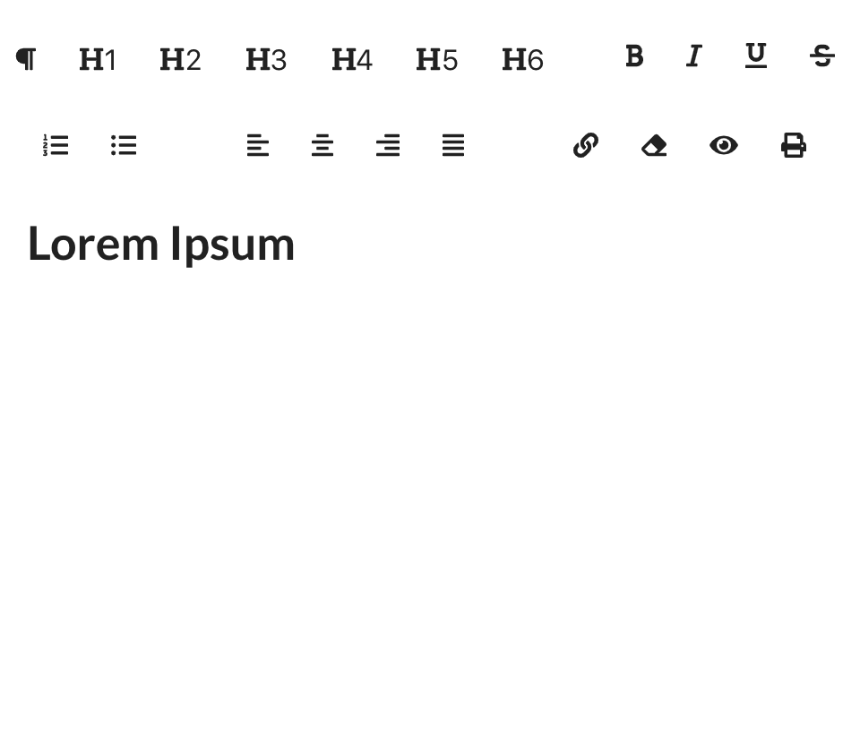

# Material UI Editor
[](https://standardjs.com)


## Example


## Installation

```sh
npm install material-ui-editor
```

## Usage


```js
import Editor from 'material-ui-editor'

// ...

render() {
  return (
    <div>
      //...
      <Editor content={"<h1>Lorem Ipsum</h1>"}
              onChange={(content)=>{}}/>
    </div>
  )
}
```

### Material UI Image Properties

|Name               |Type        |Default                                                                     |Description
|-------------------|------------|----------------------------------------------------------------------------|--------------------------------
|content            | `string`   | ''                                                                         | HTML or a text string as an input
|onChange*          | `func`     |                                                                            | onChange handler of the Editor.
|editorStyle        | `object`   | { minHeight: 300, maxHeight: 350, overflowY: 'scroll', outline: 'none' }   | Override the editorStyle style.

\* required property

## License

The files included in this repository are licensed under the MIT license.
